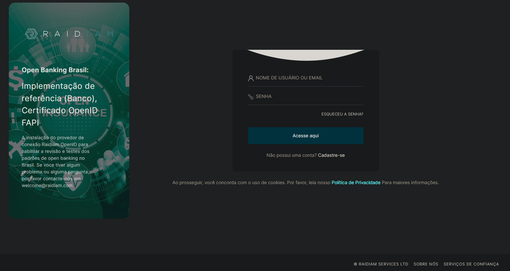
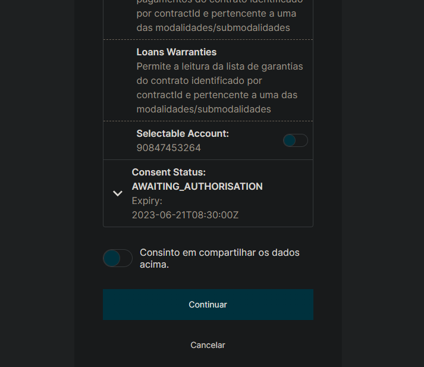

## Exemplo de utilização contra Raidiam Mock Bank

O AuthorisationServerId principal para o mock bank é o
"c8f0bf49-4744-4933-8960-7add6e590841", que pode ser conferido
na [documentação](https://gitlab.com/obb1/certification/-/wikis/Discovery-of-the-Mock-Bank)
do mock bank.

Com o produto de ooc core ligado, também é possível chamar
o endpoint /opus-open-finance/participants do diretório de
participantes para buscar os dados do mock bank,encontrando
o mesmo AuthorisationServerId citado. Vale ressaltar que é
possível fazer testes sobre uma versão local do mock bank,
que pode ser encontrado no diretório sobre o nome de
**"Raidiam Mock Bank - Dev"**.

Em mãos do Id do AuthorisationServer do mock bank então
pode-se iniciar a criação do consentimento, seja de **dados cadastrais** ou
**iniciação de pagamentos**. Os cpf's e cnpj's possíveis, assim como os dados de
usuário e senha podem ser pegos na [documentação](https://gitlab.com/raidiam-conformance/open-finance/certification/-/wikis/home).

### 1 - Dados cadastrais

**Exemplo para consentimento de dados cadastrais:**

```json
{
    "data": {
        "callbackApplicationUri": "https://oob4tpp-callback-url.com/",
        "loggedUser": {
            "document": {
                "identification": "76109277673",
                "rel": "CPF"
            }
        },
        "businessEntity": {
            "document": {
                "identification": "11111678912329",
                "rel": "CNPJ"
            }
        },
        "permissions": [
            "ACCOUNTS_READ",
            "ACCOUNTS_BALANCES_READ",
            "ACCOUNTS_TRANSACTIONS_READ",
            "ACCOUNTS_OVERDRAFT_LIMITS_READ",
            "RESOURCES_READ"
        ],
        "expirationDateTime": "2023-06-21T08:30:00Z"
    }
}
```

Após o post consent é preciso autorizar o consentimento com os dados
de usuário e senha na tela do mock bank. Os dados se encontram na documentação
supracitada, mas a título de exemplo podemos usar o usuário: ralph.bragg@gmail.com
e a senha: P@ssword01, referentes ao cpf utilizado no json acima.



Em seguida, ao inserir os dados de usuário, é feita a seleção e confirmação dos
recursos compartilhados, finalizando assim o processo de autorização do
consentimento.



Com o consentimento autorizado podemos fazer demais chamadas aos endpoints,
nesse caso em questão como testamos um consetimento de compartilhamento de
dados podemos chamar, por exemplo, o endpoint de **GetAccounts**, recebendo a
resposta a seguir.

```json
{
    "data": [
        {
            "brandName": "Sib Bank",
            "companyCnpj": "40156018000100",
            "type": "CONTA_DEPOSITO_A_VISTA",
            "compeCode": "123",
            "branchCode": "6272",
            "number": "94088392",
            "checkDigit": "4",
            "accountId": "291e5a29-49ed-401f-a583-193caa7aceee"
        },
        {
            "brandName": "Sib Bank",
            "companyCnpj": "40156018000100",
            "type": "CONTA_POUPANCA",
            "compeCode": "123",
            "branchCode": "6272",
            "number": "11188222",
            "checkDigit": "4",
            "accountId": "291e5a29-49ed-401f-a583-193caa7acddd"
        }
    ],
    "links": {
        "self": "https://matls-api.mockbank.poc.raidiam.io/open-banking/accounts/v1/accounts?page-size=25&page=1",
        "first": "https://matls-api.mockbank.poc.raidiam.io/open-banking/accounts/v1/accounts?page-size=25&page=1",
        "last": "https://matls-api.mockbank.poc.raidiam.io/open-banking/accounts/v1/accounts?page-size=25&page=1"
    },
    "meta": {
        "totalRecords": 2,
        "totalPages": 1,
        "requestDateTime": "2022-10-26T12:12:52Z"
    }
}
```

### 2 - Iniciação de pagamentos

**Exemplo para consentimento de iniciação de pagamento:**

```json
{
    "data": {
        "callbackApplicationUri": "https://oob4tpp-callback-url.com/",
        "loggedUser": {
            "document": {
                "identification": "76109277673",
                "rel": "CPF"
            }
        },
        "creditor": {
            "personType": "PESSOA_NATURAL",
            "cpfCnpj": "40506358879",
            "name": "Marco Antonio de Brito"
        },
        "payment": {
            "type": "PIX",
            "currency": "BRL",
            "amount": "10.00",
            "schedule": {
                "single": {
                    "date": "2023-06-28"
                }
            },
            "details": {
                "localInstrument": "MANU",
                "creditorAccount": {
                    "ispb": "12345678",
                    "issuer": "1774",
                    "number": "1234567890",
                    "accountType": "CACC"
                }
            }
        }
    }
}
```

Após o post consent o procedimento é semelhante ao caso de dados cadastrais, autorizando
o usuário e aprovando o consentimento(usuário: ralph.bragg@gmail.com
e a senha: P@ssword01), pode-se seguir ao chamar os demais endpoints.

**Exemplo de body do request de Pix:**

```json
{
    "data": {
      "localInstrument": "MANU",
      "payment": {
        "amount": "10.00",
        "currency": "BRL"
      },
      "creditorAccount": {
        "ispb": "12345678",
        "issuer": "1774",
        "number": "1234567890",
        "accountType": "CACC"
      },
      "remittanceInformation": "Pagamento da nota XPTO035-002.",
      "cnpjInitiator": "00000000000191",
      "endToEndId": "E9040088820210128000800123873170"
    }
}
```
