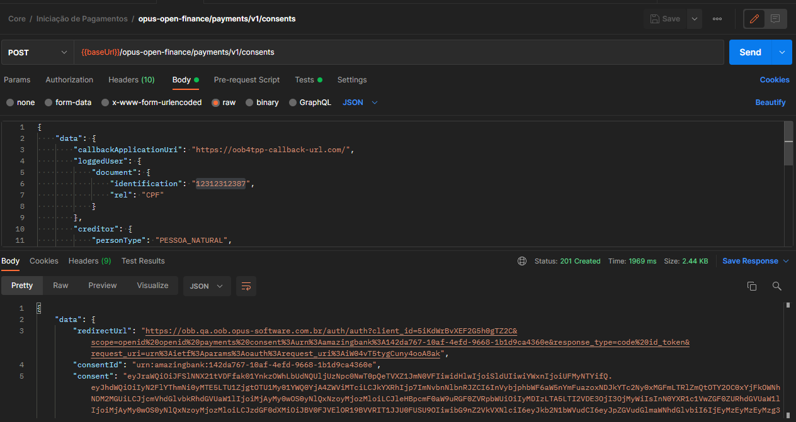

# Postman collection

Esta seção contém arquivos para serem utilizados com a ferramenta [Postman](https://www.postman.com/).
O arquivo de [collection](./chamadas_teste_open_banking.postman_collection.json)
contém chamadas de exemplo para todos os endpoints de
compartilhamento de dados (*"fase 2"*)
e iniciação de transação de pagamento (*"fase 3"*).
O arquivo de [environments](./ambiente_teste.postman_environment.json)
deve ser utilizado em conjunto e contém configurações e variáveis de ambiente.

## Variáveis de ambiente

|       variável        | descrição |
| :-------------------: | :--------------------------------------------------- |
|       `consentId`       | Identificador único do consentimento [URN](https://datatracker.ietf.org/doc/html/rfc8141), gerado automaticamente pelo POST de consentimento |
|     `applicationId`     | Identificador do aplicativo que realiza a requisição |
| `authorisationServerId` | Identificador do servidor de autenticação da instituição |

## Como utilizar a collection

Primeiramente é necessário garantir que o ambiente esteja ativado.

Agora é possível fazer um pedido de consentimento.

Seguir o `redirectUrl` da resposta e se autenticar.

No cenário web o fluxo termina com `callbackApplicationUri` seguido do
resultado OIDC como vemos na imagem abaixo.

No cenário app o fluxo termina com o resultado OIDC interpretado pela API
`POST /authorization-result` como vemos na imagem abaixo.

Com essa autenticação podem ser feitos as demais chamadas da fase.

Maiores detalhes sobre o fluxo de requisição e consumo de consentimentos estão
disponíveis nas seções sobre
[Recepção de Dados](../../utilizacao/open-finance-dados/readme.md)
e [Iniciação de Transação de Pagamento](../../utilizacao/open-finance-pagamentos/readme.md).
