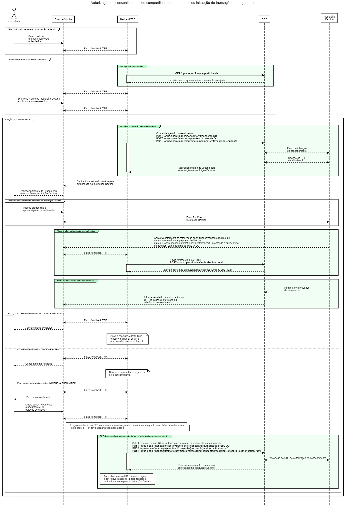
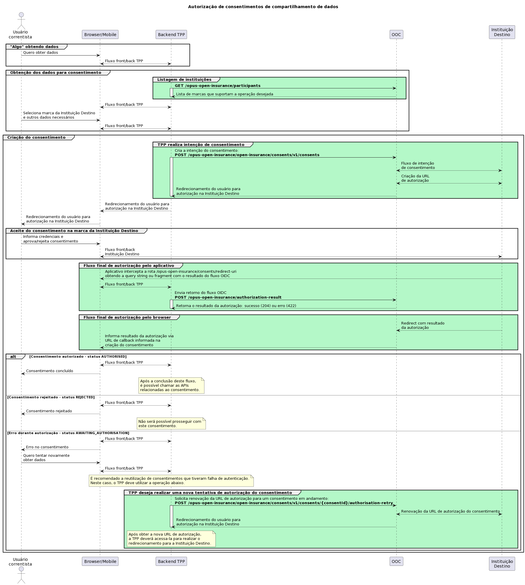
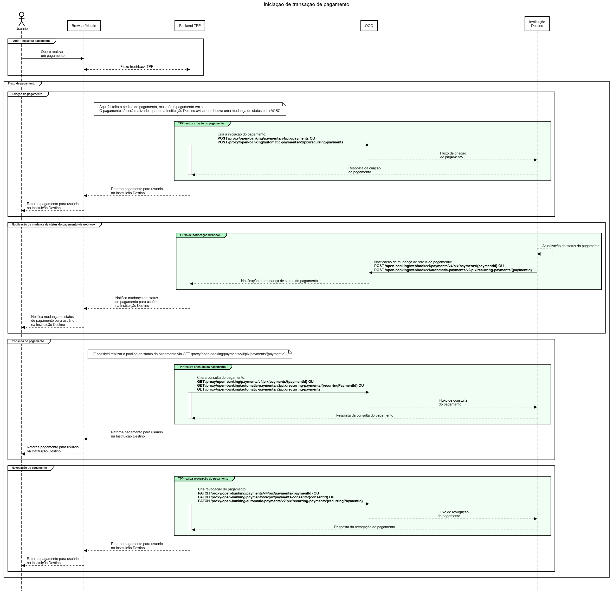
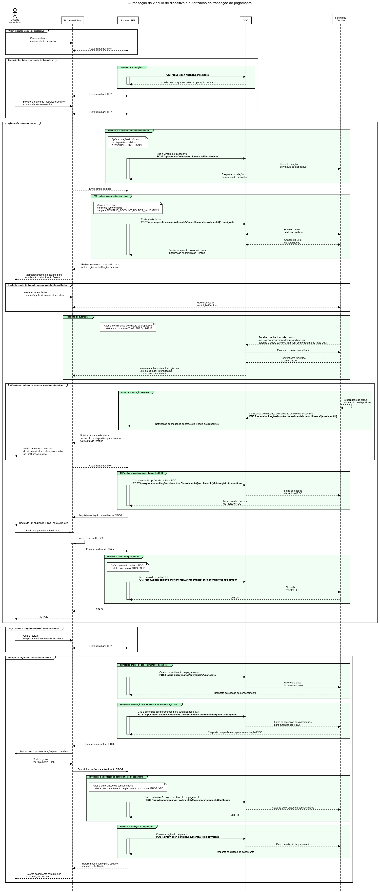

# Utilização do produto

Uma vez que a configuração prévia no Diretório de Participantes já tenha sido feita
(mais detalhes [aqui](../configuracao&#32;do&#32;produto/readme.md))
e o produto tenha sido devidamente configurado seja para open finance
(detalhes [aqui](../deploy/oofc-core/readme.md)) ou
open insurance (detalhes [aqui](../deploy/ooic-core/readme.md)),
é possível solicitar a criação de consentimentos.

## APIs de consentimento e *proxies* de utilização

O Opus Open Client oferece dois tipos de APIs:

- **APIs de solicitação de consentimento**:
simplificam o fluxo de criação e autorização de consentimento,
e garantem a geração dos tokens de acesso necessários.
- **APIs de utilização de consentimento**:
para utilização de um consentimento aprovado,
o OOC oferece APIs de *proxy* que se comportam
de maneira idêntica às APIs regulatórias
e garantem a correta utilização dos tokens de acesso gerados previamente.

## Fluxo de solicitação de consentimento

O fluxo para solicitação de consentimentos é muito similar
para recepção de dados e para iniciação de pagamento,
com diferença em apenas uma chamada.

Para o Open Finance temos o seguinte diagrama:



Para o Open Insurance temos o seguinte diagrama:



### 1 - Listagem das Instituições do Diretório de Participantes - GET /opus-open-finance/participants ou /opus-open-insurance/participants

Esta chamada retorna a lista de *marcas* de instituições cadastradas no
Diretório de Participantes do Open Finance Brasil
ou Open Insurance Brasil que suportam as operações selecionadas,
exemplo: *"instituições que suportam pagamento Pix"*.

Existem dois tipos básicos de ***Instituições Destino***,
que podem também ser filtradas de acordo com as operações que suportam:

- ***Transmissoras de Dados***: permitem compartilhamento de dados cadastrais e transacionais.
- ***Detentoras de Conta***: permitem operações de iniciação de pagamento.

> O `AuthorisationServerId` da marca da instituição selecionada
deve ser utilizado no header `x-authorisation-server-id` das demais chamadas.

A filtragem da chamada pode ser feita por meio da **role** ou do **familyType**:

- A role diz respeito ao papel regulador da instituição e tem 4 tipos:
DADOS, PAGTO, CONTA e CCORR.
- O familyType é referente ao retorno das **ApiResources** das instituições.
Cada ApiResource possui uma propriedade `ApiFamilyType`,
exemplo: "customers-business"

### 2 - Criação da intenção de consentimento

Nesta etapa, os endpoints utilizados são diferentes:

- Open Finance - Obtenção de dados cadastrais e transacionais: POST /opus-open-finance/consents/v1/consents
- Open Finance - Iniciação de pagamento: POST /opus-open-finance/payments/v1/consents
- Open Finance - Iniciação de pagamento automático: POST /opus-open-finance/automatic-payments/v1/recurring-consents
- Open Insurance - Obtenção de dados cadastrais e apólices: POST /opus-open-insurance/open-insurance/consents/v1/consents

Esta chamada envia à Instituição Destino (Transmissora ou Detentora)
as informações do consentimento que se deseja criar.
Uma resposta com código HTTP 201 Created significa que
o pedido de consentimento foi criado,
e o payload contém o código identificador do consentimento (`consentId`)
que deverá ser utilizado nas etapas seguintes.

O status do consentimento após esta etapa é **AWAITING_AUTHORISATION**.

**Importante**: Para obtenção de dados cadastrais e transacionais na chamada à Instituição
Destino (Transmissora ou Detentora), caso a instituição disponibilize mais de uma
versão de API, a chamada será realizada sempre com a maior versão, ou seja,
se disponível a versão 1 e versão 2 a chamada será através da versão 2.

### 3 - Redirecionamento do usuário para autorização na Instituição Destino

Após a criação do consentimento,
o usuário deve ser redirecionado para a Instituição Destino.

> A URL de autorização é retornada na etapa anterior.

Uma vez identificado,
o usuário poderá ver as informações do consentimento solicitado e
aprová-lo (ou rejeitá-lo) no ambiente da Instituição Destino.

Após esse processo ele estará na etapa final do fluxo de autorização.

Caso a aplicação TPP seja mobile:

- O aplivativo mobile deverá interceptar as URLs de redirecionamento descritas
nos diagramas acima e em seguida acionar o endpoint `authorization-result`
enviando o resultado do fluxo OIDC obtido. O retorno dessa chamada será o final
do fluxo de autorização, seja num cenário de sucesso (`204`)  ou erro (`422`).
Maiores detalhes sobre essa parte específica do fluxo podem ser conferidos na
documentação sobre o [redirecionamento app-to-app](./redirecionamento-app-to-app/readme.md).

> Atenção!
>
> Ainda que a solução do TPP seja 100% um aplicativo mobile é obrigatória a
implementação da rota de redirect web para tratamento de casos onde o usuário
escolha abrir a URL de callback com outro aplicativo que não o TPP. Essa
implementação visa garantir uma boa experiência de navegação ao usuário. Se
a instituição não implementar o tratamento da rota de redirect web não há como
o usuário saber o resultado final do fluxo, ou seja, ele não consegue
identificar se a autorização do consentimento foi bem sucedida ou não.

Caso a aplicação TPP seja disponibilizada via browser:

- O usuário será redirecionado automaticamente de volta para a aplicação TPP
com o resultado da solicitação.

Esse resultado deve ser enviado em sua totalidade para o Opus Open Finance
Client.

### 3.1 - Nova tentativa de autorização do consentimento

Em casos de falha no fluxo do redirecionamento
(ex.: o servidor da transmissora retornou HTTP 500, timeout, etc),
a recomendação do BACEN é a **reutilização da mesma intenção de consentimento**.

Para isso, o OOC oferece três endpoints:

- Open Finance - Obtenção de dados cadastrais e transacionais: POST /opus-open-finance/consents/v1/consents/{consentId}/authorisation-retry
- Open Finance - Iniciação de pagamento: POST /opus-open-finance/payments/v1/consents/{consentId}/authorisation-retry
- Open Insurance - Obtenção de dados cadastrais e apólices: POST /opus-open-insurance/open-insurance/consents/v1/consents/{consentId}/authorisation-retry

> Esta operação pode ser realizada enquanto o status do consentimento for **AWAITING_AUTHORISATION**
(5 minutos para iniciação de pagamento e 60 minutos para compartilhamento de dados).

### 4 - Retorno do resultado da autorização de consentimento

Após a aprovação (ou rejeição) do consentimento na Instituição Destino,
o usuário é redirecionado de volta à aplicação TPP.
Através desta chamada, a aplicação encaminha o resultado recebido para o
Opus Open Client.

Caso o consentimento seja aprovado, seu status será alterado para **AUTHORISED**
e os tokens de acesso serão gerados automaticamente pelo OOC
junto à Instituição Destino.
Eles serão armazenados pelo OOC e utilizados de maneira transparente
nas etapas de utilização do consentimento.

Caso o consentimento seja negado, seu status será alterado para **REJECTED**
e o fluxo será encerrado.

Além disso, é possível que o consentimento permaneça no status **AWAITING_AUTHORISATION**.
Neste caso, pode-se realizar uma [nova tentativa de autorização do consentimento](#31---nova-tentativa-de-autorização-do-consentimento).

## Utilização do consentimento

Depois que um consentimento é aprovado, ele pode ser utilizado para
obtenção de dados ou para iniciação de pagamento ou pagamento automático.
Chamamos essa etapa de *utilização do consentimento*,
e para isso podem ser utilizadas as APIs de proxy,
detalhadas nas páginas a seguir:

- [Recepção de Dados Cadastrais e Transacionais](./open-finance-dados/readme.md).
- [Iniciação de Transação de Pagamento](./open-finance-pagamentos/readme.md#iniciação-de-pagamento).
- [Iniciação de Transação de Pagamento Automático](./open-finance-pagamentos/readme.md#iniciação-de-pagamento-automático).
- [Recepção de Dados Cadastrais e Apólices](./open-insurance-dados/readme.md).

> :warning: Os consentimentos de compartilhamento de dados
e de iniciação de pagamento são desvinculados entre si, ou seja,
um consentimento de leitura de dados
**NÃO** pode ser utilizado para criar um pagamento (e vice-versa).

## Paginação

Algumas das APIs de proxy possuem em seu retorno os links de paginação
definidos pela detentora/transmissora, como no exemplo de **Open Finance** a seguir:

```json
{
  "data": {},
  "links": {
    "self": "https://mtls-api.banco.com.br/open-banking/api/v2/resource?page=2&page-size=25",
    "first": "https://mtls-api.banco.com.br/open-banking/api/v2/resource?page=2&page-size=25",
    "prev": "https://mtls-api.banco.com.br/open-banking/api/v2/resource?page=1&page-size=25",
    "next": "https://mtls-api.banco.com.br/open-banking/api/v2/resource?page=3&page-size=25",
    "last": "https://mtls-api.banco.com.br/open-banking/api/v2/resource?page=5&page-size=25"
  }
}
```

Caso a instituição queira acessar um dos links, deverá substituir
seu FQDN pelo do ***Opus Open Client*** mantendo os query parameters após
o carácter *?*.

Considerando o exemplo acima, os recursos da próxima página deveriam ser acessados
através da seguinte URL: `https://ooc.instituicao.com.br/proxy/open-banking/resources/v2/resources?page=3&page-size=25`

Analogamente podemos ter essa paginação como no exemplo de **Open Insurance** a seguir:

```json
{
  "data": {},
  "links": {
    "self": "https://mtls-api.seguradora.com.br/open-insurance/api/v1/resource?page=2&page-size=25",
    "first": "https://mtls-api.seguradora.com.br/open-insurance/api/v1/resource?page=2&page-size=25",
    "prev": "https://mtls-api.seguradora.com.br/open-insurance/api/v1/resource?page=1&page-size=25",
    "next": "https://mtls-api.seguradora.com.br/open-insurance/api/v1/resource?page=3&page-size=25",
    "last": "https://mtls-api.seguradora.com.br/open-insurance/api/v1/resource?page=5&page-size=25"
  }
}
```

Caso a instituição queira acessar um dos links, deverá substituir
seu FQDN pelo do ***Opus Open Client*** mantendo os query parameters após
o carácter *?*.

Considerando o exemplo acima, os recursos da próxima página deveriam ser acessados
através da seguinte URL: `https://ooc.instituicao.com.br/proxy/open-insurance/resources/v1/resources?page=3&page-size=25`

## Fluxo de solicitação de iniciação de pagamento

O fluxo para solicitação de iniciação de pagamentos deve ser
realizado após a autorização do consentimento de pagamento.

Para esse fluxo devem ser utilizadas as APIs de proxy
que podem ser detalhadas nas seguintes paginas:

- [Iniciação de Transação de Pagamento](./open-finance-pagamentos/readme.md#iniciação-de-pagamento).
- [Iniciação de Transação de Pagamento Automático](./open-finance-pagamentos/readme.md#iniciação-de-pagamento-automático).



## Fluxo de solicitação de vínculo de dispositivo



### 1 - Listagem das Instituições do Diretório de Participantes - GET /opus-open-finance/participants

Segue da mesma forma que é feito no
consentimento [Listagem das Instituições do Diretório de Participantes](#1---listagem-das-instituições-do-diretório-de-participantes---get-opus-open-financeparticipants-ou-opus-open-insuranceparticipants).

### 2 - Criação do vínculo de dispositivo

Nesta etapa, o endpoint utilizado é:

- POST /opus-open-finance/enrollments/v1/enrollments

Esta chamada envia à Instituição Destino (Detentora)
as informações do vínculo de dispositivo que se deseja criar.
Uma resposta com código HTTP 201 Created significa que
o pedido de vínculo foi criado,
e o payload contém o código identificador do vínculo de dispositivo (`enrollmentId`)
que deverá ser utilizado nas etapas seguintes.

O status do vínculo de dispositivo após esta etapa é **AWAITING_RISK_SIGNALS**.

**Importante**: Caso a instituição (Detentora) disponibilize mais de uma
versão de API, a chamada será realizada sempre com a maior versão, ou seja,
se disponível a versão 1 e versão 2 a chamada será através da versão 2.

### 3 - Envio dos sinais de risco

Nesta etapa o endpoint utilizado é:

- POST /opus-open-finance/enrollments/v1/enrollments/{enrollmentId}/risk-signals

Esta chamada envia à Instituição Destino (Detentora)
as informações dos sinais de risco.
Ela retorna a URL de autorização para que o usuário
seja redirecionado para a Instituição Destino.

O status do vínculo de dispositivo após esta etapa vai para **AWAITING_ACCOUNT_HOLDER_VALIDATION**.

### 4 - Redirecionamento do usuário para autorização na Instituição Destino

Após o envio dos sinais de risco,
o usuário deve ser redirecionado para a Instituição Destino.

Uma vez identificado,
o usuário poderá adicionar limites para transaçôes,
adicionar data de expiração do vínculo, adicionar o nome
do dispositivo e confirma-lo (ou rejeita-lo) no
ambiente da Instituição Destino.

Após esse processo ele estará na etapa final do fluxo de autorização.

### 5 - Retorno do resultado da autorização de vínculo de dispositivo

Após a confirmação (ou rejeição) do vínculo de dispositivo na Instituição Destino,
o resultado é recebido pelo Opus Open Client, onde é processado o retorno
do fluxo OIDC e realizado o processo de callback para geração de tokens.
Após isso, o usuário é redirecionado de volta à aplicação TPP com o resultado da
autorização.

Caso o vínculo de dispositivo seja confirmado, seu status será alterado para **AWAITING_ENROLLMENT**
e os tokens de acesso serão gerados automaticamente pelo Opus Open Client
junto à Instituição Destino.
Eles serão armazenados pelo Opus Open Client e utilizados de maneira transparente
nas etapas de utilização do vínculo de dispositivo.

Caso o vínculo de dispositivo seja negado, seu status será alterado para **REJECTED**
e o fluxo será encerrado.

### 6 - Envio das opções de registro FIDO

Após o processo de autorização é necessário enviar as opções de registro FIDO.

Nesta etapa o endpoint utilizado é:

- POST /proxy/open-banking/enrollments/v2/enrollments/{enrollmentId}/fido-registration-options

Está chamada busca na Instituição Destino as informações necessarias para realizar
a autenticação FIDO2.

Com as opções de registro o usuário deve realizar o gesto de autenticação
(ex.: biometrica, PIN) para criar a credencial FIDO2.

### 7 - Envio do registro FIDO

Após o usuário realizar o gesto de autenticação e for criado
a credencial FIDO2, é necessario enviar a credencial para a Instituição
Destino.

Nesta etapa o endpoint utilizado é:

- POST /proxy/open-banking/enrollments/v2/enrollments/{enrollmentId}/fido-registration

Está chamada envia os dados da credencial FIDO2 para
a Instituição Destino.

O status do vínculo de dispositivo após esta etapa vai para **AUTHORISED**.

### 8 - Criação do pagamento

Depois que o vínculo de dispositivo é aprovado, ele pode ser utilizado para
intenção do consentimento de pagamento.

Para isso, é necessário iniciar uma intenção de consentimento de pagamento via:

- POST /opus-open-finance/payments/v1/consents

### 9 - Obtenção dos parâmetros para autenticação FIDO

Após iniciar uma intenção de consentimento de pagamento é necessário obter os
parâmetros para autenticação FIDO através do endpoint:

- POST /opus-open-finance/enrollments/v1/enrollments/{enrollmentId}/fido-sign-options

Está chamada envia os dados do Relying Party e a plataforma sobre a qual
o usuário está utilizando o serviço da iniciadora para utilização de FIDO2.
E envia o ID da intenção de consentimento de pagamento para atrelar
o consentimento ao vículo de dispositivo.

Após a obtenção dos parâmetros para autenticação é necessário que o usuário
realize o gesto de autenticação (ex.: biometria, PIN) e envie os dados
(ex.: fidoAssertion, sinais de risco) para o Opus Open Client.

### 10 - Autorização do consentimento de pagamento

Após o usuário realizar a autenticação FIDO2 é necessário realizar
a autorização do consentimento de pagamento.

Nesta etapa o endpoint utilizado é:

- POST /proxy/open-banking/enrollments/v2/consents/{consentId}/authorise

Está chamada envia os sinais de risco e os dados da asserção FIDO2 para
a Instituição Destino.

Após a autorização do consentimento o status do consentimento de pagamento vai
para **AUTHORISED**

Com isso, a iniciação do pagamento pode ser realizado no padrão dos demais fluxos.
